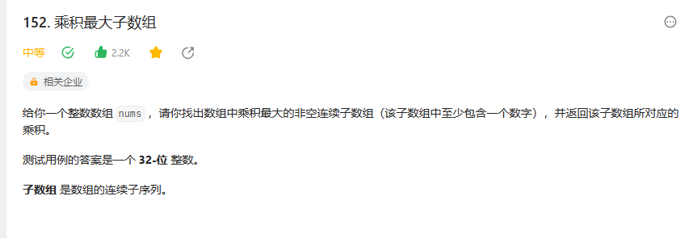

# 152. 乘积最大子数组


## 解题思路

  


```java

class Solution {
    public int maxProduct(int[] nums) {
        int n = nums.length;

        if(n == 0){
            return 0;
        }

        int[] dpMax = new int[n];
        dpMax[0] = nums[0];
        int[] dpMin = new int[n];
        dpMin[0] = nums[0];
        int max = nums[0];

        for(int i = 1; i < n; i++){
            dpMax[i] = Math.max(dpMin[i - 1] * nums[i], Math.max(dpMax[i - 1] * nums[i],nums[i]));

            dpMin[i] = Math.min(dpMin[i - 1] * nums[i],Math.min(dpMax[i - 1] * nums[i],nums[i]));

            max = Math.max(max,dpMax[i]);
        }

        return max;
    }
}

```

