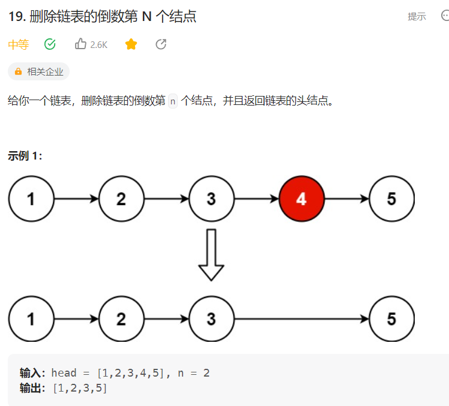

# 19. 删除链表的倒数第 N 个结点


## 解题思路

  

* 快慢指针
* 删除倒数第n个节点 那么需要找到它的前驱节点，然后删除
* 那么需要找到倒数第n + 1个节点
* 设置快慢指针fast slow指针，先让fast指针走n + 1个节点 然后停下，快慢指针同时开始移动
* 当快指针移动到null 之后，慢指针指向的就是倒数第n + 1个节点，然后删除倒数第n个节点即可


```java
/**
 * Definition for singly-linked list.
 * public class ListNode {
 *     int val;
 *     ListNode next;
 *     ListNode() {}
 *     ListNode(int val) { this.val = val; }
 *     ListNode(int val, ListNode next) { this.val = val; this.next = next; }
 * }
 */
class Solution {
    public ListNode removeNthFromEnd(ListNode head, int n) {
        // 使用双指针  快慢指针算法  
        // 删除倒数第n个节点 让fast移动n个节点  然后fast和slow同时开始移动
        // 当fast指针指向链表末尾的时候  删除slow指向的节点就可以

        // 思路是使得快慢指针之间差距n个节点
        // 那么当快指针走到null 的时候 那么因为快慢指针使用差距n个节点
        // 那么慢指针指向的就是倒数第n个节点

        // 创建一个哑结点
        ListNode dummyNode = new ListNode(0);
        dummyNode.next = head;

        // 创建快慢指针
        ListNode fast = dummyNode;
        ListNode slow = dummyNode;

        // 快指针走n节点
        for(int i = 0; i < n; i++){
            fast = fast.next;
        }
        // 但是要删除倒数第n个节点 那么就需要找到倒数第n+ 1个节点 
        // 也就是前驱节点
        fast = fast.next;

        // 现在快慢指针差距n + 1个节点 将快指针指向null 走到链表的末尾
        while(fast != null){
            fast = fast.next;
            slow = slow.next;
        }

        // 此时fast指向链表末尾 null slow指向倒数第N+ 1个节点
        // 那么开始删除倒数第n个节点
        slow.next = slow.next.next;


        return dummyNode.next;// 返回head
    }
}

```

