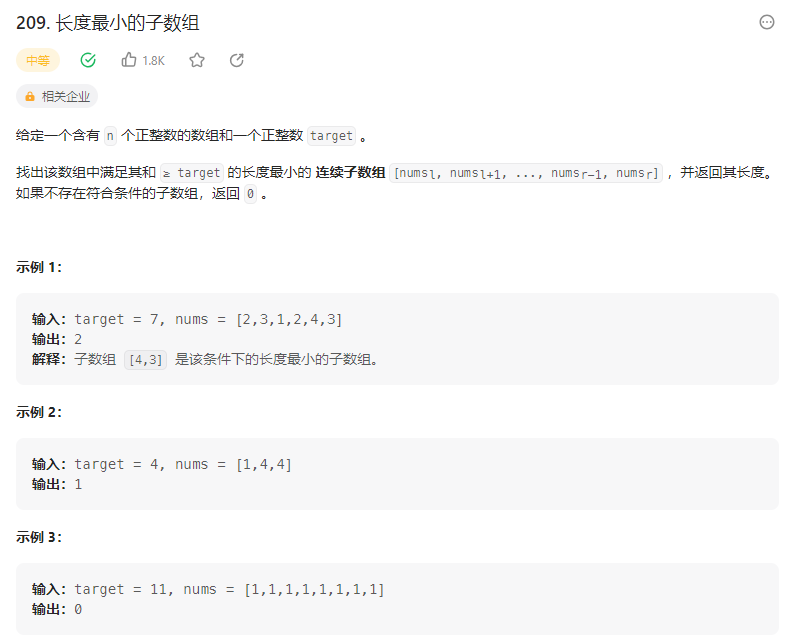

# 209. 长度最小的子数组

## 解题思路

  

* 滑动窗口
* 设置前后指针
* 滑动窗口内的元素之和总是大于或者等于s
* 滑动窗口的起始位置: 如果窗口的值大于等于s 窗口向前移动  
* 窗口结束位置:for循环的j

```java
class Solution {
    public int minSubArrayLen(int target, int[] nums) {
        int left= 0;// 滑动窗口的起始位置
        int right = 0;// 滑动窗口的结束位置  其实就是for循环的j
        int result = 99999999;
        int sum = 0;

        // 关键在于如何改变滑动窗口的起始位置  当窗口的和大于等于s 更新result 然后向前移动一个位置
        for(right = 0; right < nums.length; right++){
            sum += nums[right];
            // 窗口向前移动
            while(sum >= target){
                // 更新result
                int sub = right - left + 1;
                result = result < sub ? result : sub;
                sum -= nums[left++];// 滑动窗口向前移动
            }
        }

        return result == 99999999 ? 0 : result;
    }
}
```

