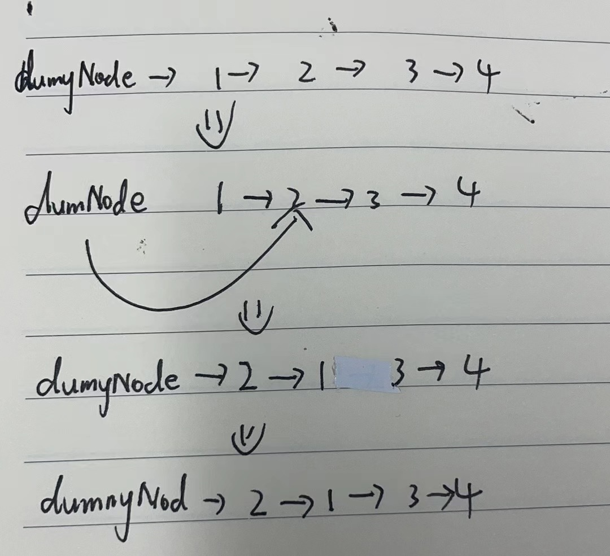

# 24. 两两交换链表中的节点


## 解题思路

  


```java
/**
 * Definition for singly-linked list.
 * public class ListNode {
 *     int val;
 *     ListNode next;
 *     ListNode() {}
 *     ListNode(int val) { this.val = val; }
 *     ListNode(int val, ListNode next) { this.val = val; this.next = next; }
 * }
 */
class Solution {
    public ListNode swapPairs(ListNode head) {
       // 创建一个哑结点 指向head
       ListNode dummyNode = new ListNode(0);
       dummyNode.next = head;
       ListNode cur =  dummyNode;// 当前指针指向哑结点  这里的cur是前驱指针

       // 创建临时节点
       ListNode temp;
       ListNode first;// 保存需要交换的节点的第一个节点
       ListNode second;// 保存需要交换的节点的第二个节点

        // cur一开始指向 1 2
        while(cur.next != null && cur.next.next != null){
            // 在开始交换之前 需要保存一下后面的节点
            temp = cur.next.next.next;// 也就是3节点

            // first保存1号 节点
            first = cur.next;
            // second保存2号节点  
            second = cur.next.next;
            // 然后cur指向2结点
            cur.next = second;
            // 2节点指向1节点
            second.next = first;
            // 1节点指向3 也就是指向temp
            first.next = temp;

            //  交换完毕之后  移动指针
            cur = first;
        }

        return dummyNode.next;

    }
}

```
