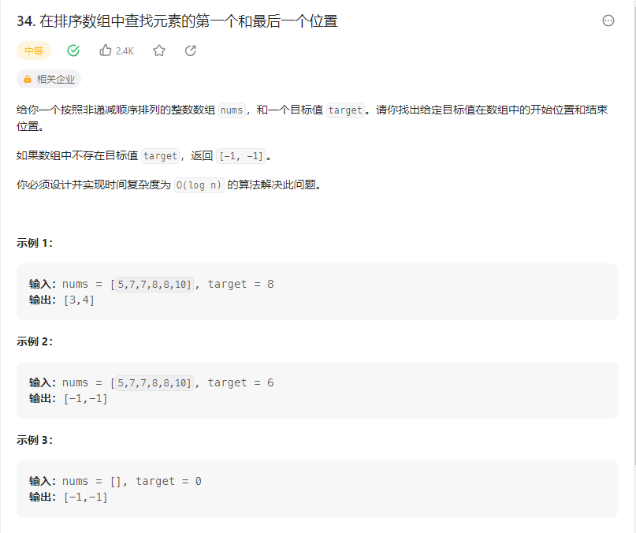

# 34. 在排序数组中查找元素的第一个和最后一个位置


## 解题思路

  

* 使用二分查找
* 查找到目标元素的索引之后 
* 然后向左以及向右寻找目标元素，然后记录下区间位置 然后保存下来


```cpp
class Solution {
    public int[] searchRange(int[] nums, int target) {
        // 使用二分查找  数组有序
        int left = 0;
        int right = nums.length  - 1;
        int[] result = new int[2];
        while(left <= right){
            int mid = left + (right - left) / 2;
            if(nums[mid] > target){
                right = mid  -1;
            }else if(nums[mid] < target){
                left = mid + 1;
            }else{
                // 找到目标元素之后
                // 寻找mid左右的区间
                int i = mid;
                int j = mid;

                // 寻找右边区间
                while(j <= nums.length - 1 && nums[j] == target){
                    j++;
                }

                while(i >= 0 && nums[i] == target){
                    i--;
                }

                result[0] = ++i;
                result[1] = --j;

                return result;
            }
        }

        result[0] = -1;
        result[1] = -1;

        return result;

        
    }
}

```

