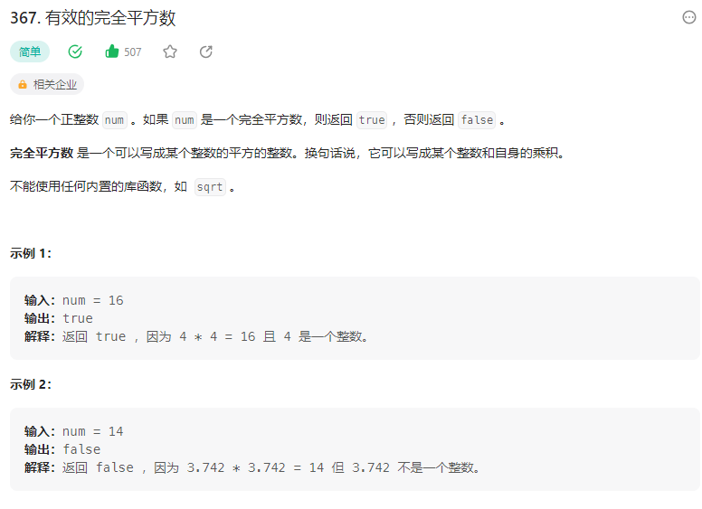

# 367. 有效的完全平方数

## 解题思路

  

* 使用二分查找
* 查找区间是[1,num]
* 针对mid * mid和num进行比较 然后更改查找区间

```cpp
class Solution {
    public boolean isPerfectSquare(int num) {
        // 二分查找  
        // 区间就是[1,num.length]

        long left = 1;
        long right = num;
        long mid = 0;

        while(left <= right){
            mid = left + (right- left)  / 2;
            long sq = mid * mid;
            if(sq > num){
                right = mid - 1;
            }else if(sq < num){
                left = mid + 1;
            }else{
                break;
            }
        }

        return mid * mid == num;
    }
}

```


