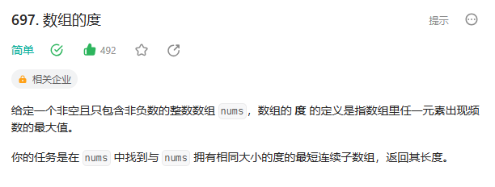

# 697. 数组的度


## 解题思路

  


* 首先创建一个IndexMap 键表示元素 值表示一个列表List list存储该元素在数组的所有索引
* 之后再次创建一个map1 针对上面的List  键表示列表的长度 值表示索引的差值
* 遍历indexmap 将所有的list的长度 和 索引的差值存储
* 遍历map1 找到最大的key 那么这个Key就是代表最大list长度 也就是代表出现最多次数的那个元素 然后取出值（代表索引差值 记得加一）


```java

class Solution {
    public int findShortestSubArray(int[] nums) {
        // 创建hashMap 键表示元素  值表示一个列表  存储该元素出现的所有索引
        Map<Integer,List<Integer>> indexMap = new HashMap<>();

        // 遍历数组
        for(int i = 0; i < nums.length; i++){
            int num = nums[i];
            if(indexMap.containsKey(num)){
                // 如果该元素已经存在 那么将新的索引添加进去
                indexMap.get(num).add(i);
            }else{
                // 如果元素不存在  创建一个新的列表 添加索引
                List<Integer> indexList = new ArrayList<>();
                indexList.add(i);
                indexMap.put(num,indexList);
            }
        }

        // 取出hashmap中值 列表长度最大的 
        Map<Integer,Integer> map1 = new HashMap<>();// 创建一个hashmap 键表示长度 值表示索引差值

        for(Map.Entry<Integer,List<Integer>> entry:indexMap.entrySet()){
            int element = entry.getKey();

            List<Integer> indexes = entry.getValue();

            if(map1.containsKey(indexes.size())){
                // 如果有相同长度的 选择索引差值小的list
                if(map1.get(indexes.size()) > (indexes.get(indexes.size() - 1) - indexes.get(0))){
                    map1.put(indexes.size(),indexes.get(indexes.size() - 1) - indexes.get(0) + 1);
                }
            }else{
                map1.put(indexes.size(),indexes.get(indexes.size() - 1) - indexes.get(0) + 1);
            }
        }

        // 遍历map1 找到键长度最大值
        int maxV = Integer.MIN_VALUE;
        for(Map.Entry<Integer,Integer> entry:map1.entrySet()){
            if(maxV <= entry.getKey()){
                maxV = entry.getKey();
            }
        }


        return map1.get(maxV);

    }
}
```


