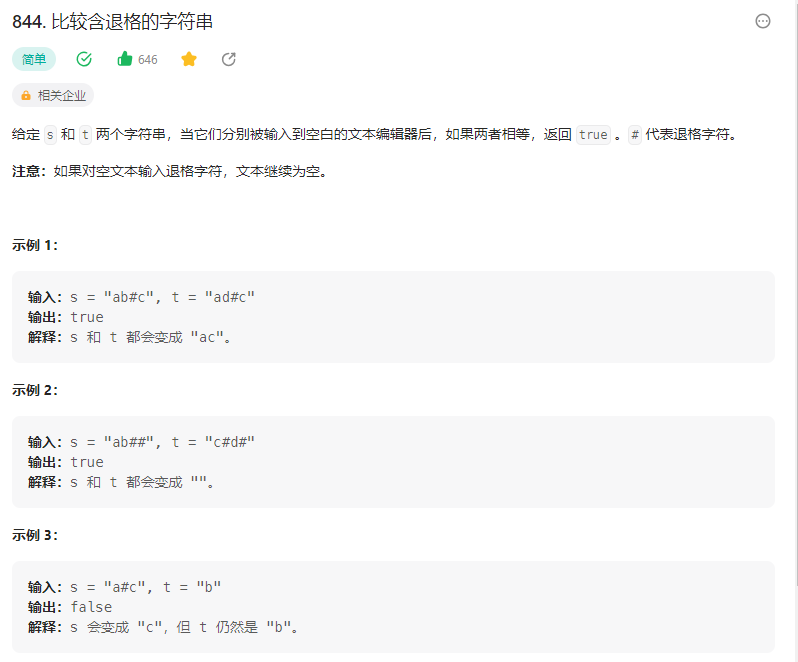

# 844. 比较含退格的字符串

## 解题思路

  

思路：函数deLETE的作用是处理带有退格符号的字符串。它使用双指针法来模拟字符串处理。初始时，慢指针slow和快指针fast都指向字符串的开头。然后，通过遍历字符串，如果当前字符不是退格符号（#），则将该字符复制到慢指针所在的位置，并且慢指针slow向后移动一位。如果当前字符是退格符号，并且慢指针slow的位置大于0（即不是字符串的开头），则将慢指针向前移动一位，相当于删除前一个字符。最后，返回处理后的字符串，使用substr函数从开头截取到慢指针slow处的子字符串。


```java
class Solution {
    public String delete(String s){
        // 使用快慢指针来删除元素 
        // 首先快慢指针同时指向字符串的末尾位置
        // 然后一起像前面移动  遇到非目标元素 都一起向前移动
        // 遇到目标元素之后 慢指针停下来 然后 快指针移动位置

        // 设置快慢指针 目标删除 # 元素还有前面一个元素
        int slow = 0;
        int fast = 0;
        char[] arr = s.toCharArray();// 转换为字符数组

        for(fast = 0; fast < s.length(); fast++){
            if(arr[fast] != '#'){
                // 快指针指向的元素 直接覆盖慢指针指向的元素 # 
                arr[slow] = arr[fast];
                // 然后slow ++
                slow++;
            }else if(slow > 0){
                slow--;// 这句话的目的在于   我们需要删除 # 前面一个字符
            }
        }

        return new String(arr,0,slow);// 返回新的字符串
    }
    public boolean backspaceCompare(String s, String t) {
        // 将两个字符串转换为 字符数组
        return delete(s).equals(delete(t));
    }
}

```