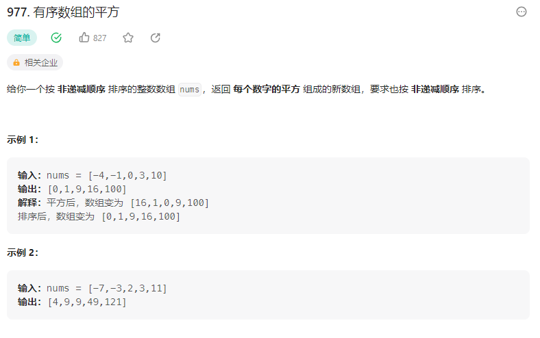

# 977. 有序数组的平方


## 解题思路

  


思路:

* 设置前后指针
* 最大的元素一定是存在再前后位置,然后因为负数平方之后可能大于整数的平方
* 每次比较前后指针指向的元素的平方  然后存下较大的元素平方 然后移动指针

```java
class Solution {
    public int[] sortedSquares(int[] nums) {
        // 设置前后指针 
        int left = 0;
        int right = nums.length - 1;
        int k = nums.length - 1;
        int[] result = new int[nums.length];// 开辟一个新的数组

        while(left <= right){
            if(nums[left] * nums[left] <= nums[right] * nums[right]){
                result[k--] = nums[right] * nums[right];
                // result[left] = nums[left] * nums[left];
                // left++;
                // 此时右指针移动 左指针不动  需要继续比较
                right--;
            }
            else{
                result[k--] = nums[left] * nums[left];
                // result[left] = nums[right] * nums[right];
                left++;
                // 左指针移动  右指针不动
                // right--;
            }
        }

        return result;
    }
}

```


